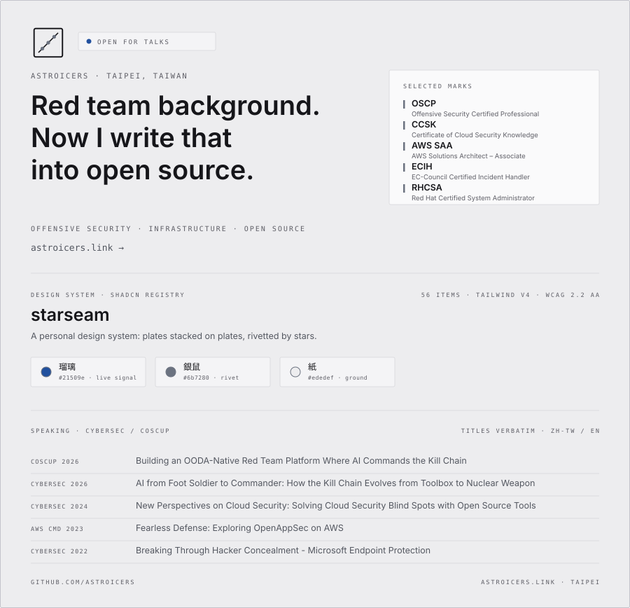

[🇺🇸 English](README.md) | [🇹🇼 繁體中文](README.zh-tw.md)

<picture>
  <source media="(prefers-color-scheme: dark)" srcset="./assets/card-en-dark.svg">
  
</picture>

# Hi, I'm Harry Chen 👋

## Offensive Security | Infrastructure | Open Source

Security engineer, out of red teaming and penetration testing. What I have been doing these last few years is writing the attacker's way of thinking into open source: an autonomous red-team platform where the AI picks its own targets and techniques, a protocol that compiles a development playbook into guardrails for AI, and the automation behind Taiwan's security content. You cannot defend what you do not understand attacking — and tools are how that understanding gets handed to the next person.

### About Me

- 🔭 Building **[Athena](https://github.com/astroicers/Athena)** - open-core, source-available **C5ISR + OODA** autonomous red-team platform (Rust): an LLM-driven OODA loop that picks the next target and technique, with scope / opsec / rules-of-engagement gates welded into the execution path
  - **[athena-sdk](https://github.com/astroicers/athena-sdk)** - Apache-2.0 Rust contract traits for hot-pluggable OODA modules
  - **[athena-tools](https://github.com/astroicers/athena-tools)** - Apache-2.0 data-driven MCP tool catalog ("add tools without touching the core")
- 📐 Created **[AI-SOP-Protocol](https://github.com/astroicers/AI-SOP-Protocol)** - compiles your dev playbook into guardrails Claude auto-loads every session (TDD, ADRs, commit gates, release checks); v5 three-tier maturity + G1–G6 quality gates, shipped as a Claude Code plugin
- 🛡️ **Taiwan security content** automation
  - **[security-weekly-mcp](https://github.com/astroicers/security-weekly-mcp)** - MCP Server-powered security weekly report (32 intl & TW sources)
  - **[security-glossary-tw](https://github.com/astroicers/security-glossary-tw)** - Taiwan cybersecurity terminology, 470+ standardized terms
  - 🌐 **[Security Glossary site](https://glossary.astroicers.link)** - Searchable web glossary of 470+ Taiwan security terms
- 🧰 **AI tooling** — skills, registries and research for agent-assisted work
  - **[starseam](https://github.com/astroicers/starseam)** - personal design system shipped as a shadcn registry — plates rivetted by stars, first-class Traditional Chinese typography; this blog wears it
  - **[Ghidra-MCP-WSL-Auto](https://github.com/astroicers/Ghidra-MCP-WSL-Auto)** - one-click Ghidra + GhidraMCP on WSL2 — an AI-assisted reverse engineering setup for security researchers
  - **[skill-quality-research](https://github.com/astroicers/skill-quality-research)** - star-gradient analysis across 97 Agent Skill repos: popularity tracks installability, not craft — ships a runnable skill-reviewer
  - **Claude Code skills** — writing rules and recipes I actually use: [talk-craft](https://github.com/astroicers/talk-craft) · [slidev-deck-stack](https://github.com/astroicers/slidev-deck-stack) · [visual-web-stack](https://github.com/astroicers/visual-web-stack)
- 🔧 **Tooling** — smaller things that solved one specific problem
  - **[outline-terraform-aws](https://github.com/astroicers/outline-terraform-aws)** - deploys Outline Wiki on AWS with Terraform and Ansible
  - **[zst2vmdk](https://github.com/astroicers/zst2vmdk)** - converts Zstandard-compressed VMA files to VMDK for virtual machine migrations
  - **[extension-guard](https://github.com/astroicers/extension-guard)** - VS Code extension supply chain security scanner

### Public record

- Found and reported an XSS vulnerability on Trend Micro's website (2020)
- Found and reported an open redirect on Dcard's website (2020)

### Tech Stack

**Languages**  ·  ·  ·  · C · Bash

**Offensive tooling** Metasploit · Cobalt Strike · Burp Suite · BloodHound · Mimikatz · Impacket · Nuclei

**Cloud & containers**  ·  ·  · AWS · Azure

**Focus areas** Red Team · Penetration Testing · Cloud Security · Zero Trust · Supply Chain Security · Reverse Engineering

### Certifications

**Offensive Security**

- 🎯 OSCP (Offensive Security Certified Professional)

**Cloud Security**

- 🔒 CCSK (Certificate of Cloud Security Knowledge)
- ☁️ AWS SAA (AWS Solutions Architect – Associate)

**Others**

- 🚨 ECIH (EC-Council Certified Incident Handler)
- 🐧 RHCSA (Red Hat Certified System Administrator)
- ☁️ Azure Fundamentals (Microsoft Azure Fundamentals)
- 🪟 MCSE (Microsoft Certified Solutions Expert)

### Speaking

| Year | Event | Topic |
|------|------|------|
| 2026 | [COSCUP × UbuCon Asia 2026](https://coscup.org/2026/) (Hackers In Taiwan) | [Building an OODA-Native Red Team Platform Where AI Commands the Kill Chain](https://coscup.org/2026/session/EHKNXW) *(with Alex Chih)* |
| 2026 | [CYBERSEC Conference](https://cybersec.ithome.com.tw/) | [AI from Foot Soldier to Commander: How the Kill Chain Evolves from Toolbox to Nuclear Weapon](https://cybersec.ithome.com.tw/2026/session/4231) *(AI Offense Forum)* |
| 2024 | [CYBERSEC Conference](https://cybersec.ithome.com.tw/) | [New Perspectives on Cloud Security: Solving Cloud Security Blind Spots with Open Source Tools](https://pastevent.cybersec.ithome.com.tw/2024/session-page/2719) |
| 2023 | [AWS Community Day Taiwan](https://awscmd.tw/2023/index.html) | Fearless Defense: Exploring OpenAppSec on AWS |
| 2022 | [CYBERSEC Conference](https://cybersec.ithome.com.tw/) | Breaking Through Hacker Concealment - Microsoft Endpoint Protection *(Microsoft Partner Speaker)* |

### Elsewhere

[GitHub](https://github.com/astroicers) · [LinkedIn](https://www.linkedin.com/in/chi-hsiu-chen-897528172/) · [Credly](https://www.credly.com/users/chi-hsiu-chen) · [Blog](https://astroicers.link)

---

*"Stay curious, stay paranoid."*
